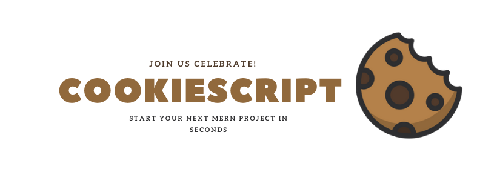

<sub>Created by <a href="https://github.com/getspooky">getspooky</a> and maintained with ❤️ by an amazing <a href="https://github.com/getspooky/CookieScript/graphs/contributors">team of developers</a>.</sub>


CookieScript Boilerplate uses familiar tools and implements best practices around them to provide you a SOLID development experience.
This project does not impose a specific development philosophy or framework, so you're free to architect your code in the way that you want.

## Features

<dl>
  <dt>Quick scaffolding</dt>
  <dd>CookieScript offers a built-in tool for the command line is known as Geek which allows performing the majority of those tedious and repetitive programming tasks that many JavaScript developers avoid performing manually.</dd>

 <dt>Next generation JavaScript</dt>
 <dd>Use template strings, object destructuring, arrow functions, JSX syntax and more.</dd>
 
 <dt>No Lock-In</dt>
 <dd>Under the hood, we use webpack, Babel, ESLint, and other amazing projects to power your app.</dd>

 <dt>UI built with Tailwind CSS</dt>
  <dd>CookieScript uses <a href="https://tailwindcss.com/" target="_blank">tailwindcss</a>
   . An elegant and simple solution to solving the issues we all face when refactoring or removing dead HTML
  </dd>

 <dt>Less to Learn</dt>
 <dd>You don't need to learn and configure many build tools. Instant reloads help you focus on development. When it's time to deploy, your bundles are optimized automatically.</dd>

   <dt>SEO friendly</dt>
  <dd>There are a few problems for search engine rankings when it comes to a vanilla `React app`. We follow best practices to make your web app attractive to `Google`.  
  </dd>

 <dt>Intact Security</dt>
  <dd>Application security is one of the most important factors in web application development. While developing an application, a programmer needs to take effective ways to secure the application.</dd>

 <dt>Authentication</dt>
  <dd>Authentication is the most important factor in a web application, and developers need to spend a lot of time writing the authentication code. CookieScript contains an inbuilt authentication system, you only need to configure models, views, and controllers to make the application work.</dd>

 <dt>Offline-first</dt>
 <dd>The next frontier in performant web apps: availability without a network connection from the instant your users load the app.</dd>

 <dt>Mail Integration</dt>
 <dd>CookieScript uses free feature-rich library NodeMailer to send emails. Using the library function, we can easily send emails without too many hassles. The e-mail templates are loaded in the same way as views, which means you can use the Blade syntax and inject data into your templates.</dd>

<dt>Database Caching</dt>
<dd>CookieScript uses redis caching service in order to create high performance services</dd>

</dl>

<sub><i>Keywords: `React.js`, Redux, Hot Reloading, ESNext, Babel, react-router, Offline First, `Nodejs`, `express`, `mongoDB` ,cli and more...</i></sub>

## System Requirements

Before you install `CookieScript`, you should check to make sure that your system has the proper prerequisites installed. These include:

- Node >= 8.0.0
- npm >= 6.10.3
- mongoDB >= 3.6.8

## Browser support

- Google Chrome
- Microsoft Edge
- Firefox
- Opera
- Safari

>This doesn't mean that `CookieScript` cannot be used in older browsers, just that we'll ensure compatibility with the ones mentioned above.

## Quick start

2.  Clone this repo using `git clone --depth=1 https://github.com/getspooky/CookieScript.git <YOUR_PROJECT_NAME>`
3.  Move to the appropriate directory: `cd <YOUR_PROJECT_NAME>`.<br />
4.  Run `npm run install` in order to install dependencies and clean the git repo.<br />
    _At this point you can run `npm run start` to see the example app at `http://localhost:8080`._
5.  Run `npm run serve` in order to start nodejs server

## Usage 

> The official guide assumes intermediate level knowledge of React, NodeJs, and MongoDB. If you are totally new to MERN development, it might not be the best idea to jump right into a boilerplate as your first step.

🍵 Let us discuss the categories included in the configuration. All of the configuration files for the `CookieScript` boilerplate are stored in the config directory. Each option is documented, so feel free to look through the files and get familiar with the options available to you. <br />
Example: 
```yml
# Application Configuration

# This value is the name of your application. This value is used when the
# mern-boilerplate needs to place the application's name in a web browser
# or notification.

default:
  name: CookieScript Demo

# Application URL
url:
  host: 127.0.0.1
  port: 4200

# Application Environment
# This value determines the "environment" your application is currently
# running in.
# Supported Application Env: production, developement, test
env:
  type: environment

```

You may easily access your configuration values using `config` helper function from anywhere in your application. The configuration values may be accessed using "dot" and "At sign" syntax, which includes the 
name of the file and option you wish to access.
A error will be thrown if the configuration option or file does not exist:

```js
// Retrieve the server's port.
value = config('app@url.port');
```

> 🚨 `config` helper function does not provide a way to set configuration values at runtime.

☕️ By default, the directory structure of `CookieScript` is meant to meet the requirement for both large and small
application development.

| Directory     | Description     |
| ------------- |:---------------:|
| config        | The config directory holds all project configutation files.  | 
| public        | The public folder contains the HTML so you can tweak it, The `<scripts>` tag with compiled code will be added to it automatically during the build process.        |   
| database      | The database directory holds your database files.
| internals     | The internals directory holds code used under the hood by `CookieScript` like `Error Handling` , `Registering Routes` ...
| server        | The server directory contains all the server-side code used to implement the REST API.
| views         | The views directory contains all of the react client code for the project. 

> 📢  We believe that each mern project is different so you can add customize your directory structure.

🌍 CookieScript's localization features provide a convenient way to retrieve strings in various languages, allowing you to easily support multiple languages within your application.
Language strings are stored in files within the `views/lang/` directory.
Within this directory there should be a json file for each language supported by the application:

```json
{
  "welcome.title": "🍪 A highly scalable, professional boilerplate for building fast",
  "welcome.subtitle": "robust and adaptable mern web apps.",
  "welcome.register": "Sign Up",
  "welcome.login": "Sign In",
}
```

You may retrieve lines from language files using the `lang` function
For example, let's create a new simple component and retrieving the welcome translation string from the `views/lang/en.json` language file: 

```js
import React from 'react';
import { withNamespaces } from 'react-i18next';

function Welcome(props) {
  const {t:lang} = props;
  return (
    <h1>{lang('welcome.title')}</h1>
  )
}

export default withNamespaces()(Welcome);
```

🔐 Authentication is the process of identifying the user credentials. CookieScript makes implementing authentication very simple. In fact, almost everything is configured for you out of the box. At its core, CookieScript's uses [JWT](https://jwt.io/) , The configuration file is located at `config/jwt.yml` which contains several well documented options.

> 🚨 By default `CookieScript` stores the given token inside an <b>httpOnly cookie</b>, a special kind of cookie that’s only sent in HTTP requests to the server, and it’s never accessible (both for reading or writing) from JavaScript running in the browser. 

The ui for authentication are stored in the `views/containers/auth/` directory. 
All of these views use the [Tailwind CSS](https://tailwindcss.com/), but you are free to customize them however you wish.
 
🚦 Requests are mapped with the help of routes. Basic routing routes the request to the associated controllers.  
All routes are defined in your route file,
which is located in the `server` directory.
The file is automatically loaded internally by the `CookieScript`.
The `server/Routes.yml` file defines routes that are for your web interface.
For example, you may access the following route by navigating to `http://your-app.test/hello` in your browser:

```yml
hello:
  path: "/hello"
  controller: "server/controllers/Hello@SayHello"
```

To assign middleware you may use the `middleware` property. Middleware are executed in the order they are listed in the array:

```yml
hello:
  path: "/hello"
  controller: "server/controllers/Hello@SayHello"
  middlewares:
    - "server/middlewares/Hello@TrimString"
```

🚧 Validation is the most important aspect while designing an application. It validates the incoming data. By default CookieScript uses a `express-validator` package to validate incoming HTTP requests with a variety of powerful validation rules.

To learn about CookieScript's powerful validation features, let's assume we have the following routes defined in our `server/Routes.yml` file:

```yml
hello:
  path: "/create/article"
  method: "POST"
  controller: "server/controllers/Article@Store"
  validator: "server/validators/Article"
```

Your Hello validator file may look like one of these, which are all valid:

```js
import { check } from 'express-validator';

// Get the validation rules that apply to the request.
export function Validator() {
  return [
    check('email')
      .not()
      .isEmpty()
      .withMessage('Email is missing')
      .isEmail()
      .withMessage('Email is not valid'),
  ];
}
```

> 🚨 Make sure that the function is called `Validator`.

Next, let's take a look at a simple controller that handles these routes. We'll leave the store method empty for now:

```js
import { validationResult } from 'express-validator';
import {
  UnprocessableEntityException
} from 'internals/utils/exceptions/unprocessable-entity';

export async function Store(req,res,next) {
  try {
    // Finds the validation errors in this request and wraps them in an object with handy functions
    const errors = validationResult(req);
    if (!errors.isEmpty()) {
      throw new UnprocessableEntityException(
        JSON.stringify(errors)
      );
    }
    return res.send('Great...');
  } catch(err) {
    next(err);
  }
}
```

💩 Most web applications have specific mechanisms for error handling. Using these, they track errors and exceptions. Logging the errors in a web application helps to track them and in planning a strategy for removing them.
The log information can be configured in the web application in `config/logging.yml`.

```yml
# Log Node.js Applications

# Here you may configure the log channels for your application. Out of
# the box, CookieScript uses the Winston logging library. This gives
# you a variety of powerful log handlers / formatters to utilize.
# level: error, warn, info, verbose, debug, silly

exitOnError: true

file:
  level: 'info' # Logging levels indicate message priority and are denoted by an integer.
  handleExceptions: true
  json: true
  maxsize: 5242880, # 5MB
  maxFiles: 5
  colorize: false

console:
  level: 'debug'
  handleExceptions: true
  json: false
  colorize: true
```

You will see a message like the following : 
```js
{"level":"error","message":"404 - Not Found - /foo - GET - ::ffff:72.80.124.207","timestamp":"2018-03-07T17:40:10.622Z"}
```

💾 CookieScript makes connecting with databases and running queries extremely simple. Currently we supports two database systems: [MongoDB](https://www.mongodb.com/) and [Redis](https://redis.io/).

The database configuration for your application is located at `config/database.yml`. In this file you may specify
database settings, such as host, username, and password.
example :

```yml
# Here you may specify which of the database connections below you wish
# to use as your default connection for all database work. Of course
# you may use many connections at once using the Database library.

default:
  name: mongodb

# Database Connections
# Here is the database connection setup for your application.
# Of course, examples of configuring each database platform that is
# Supported by CookieScript is shown below to make development simple.

connections:
  mongodb:
    db_host: localhost
    db_port: 27017
    db_name: CookieScript
    db_test_name: CookieScriptTest
    db_user:
    db_pass:
    # A full list of options can be found on the MongoDB Node.js driver docs for connect()
    # http://mongodb.github.io/node-mongodb-native/2.2/api/MongoClient.html#connect
    options:
      useCreateIndex: false
      useNewUrlParser: true
      useFindAndModify: false
      useUnifiedTopology: true

# Redis Databases
# Redis is an open source, fast, and advanced key-value store that also
# provides a richer body of commands than a typical key-value system
# such as APC or Memcached. CookieScript uses it in caching.

redis:
  expiration: 638273737
```

> 💡 CookieScript makes interacting with `MongoDB` database extremely simple by using [Mongoose](https://mongoosejs.com/).

📋 CookieScript is built with testing in mind. In fact, support for testing with [jest](https://jestjs.io/docs) is included out of the box, and a `jest.config.js` file is already setup for your application.

To test your application started with this boilerplate do the following:

* Sprinkle .test.js files directly next to the parts of your application you want to test. (Or in __tests__/ subdirectories, it doesn't really matter as long as they are directly next to those parts and end in `.(test|spec).jsx?`

* Write your unit and component tests in those files.

* Run `npm run test` in your terminal and see all the tests pass! (hopefully)

CookieScript alse provides two helpful functions to make it easier to test your database driven applications.
First, you may use the `mountDatabase` to connecting the database instance and `unmountDatabase` in order to resetting the database After each test.

```js
import {
  mountDatabase,
  unmountDatabase,
} from 'internals/testing/database';

beforeAll(async function () {
  // connect database instance.
  await mountDatabase();
});

afterAll(async function () {
  // destroy and close database.
  await unmountDatabase();
});
```

📟 CookieScript provides  a number of helpful commands that can assist you while you build your application. 
One of the biggest benefits of the `CLI` is the rapid scaffolding of the application. It allows you to generate `controllers`, `routes`, `models` and more with a simple generate command.

> 🛸 To view a list of all available commands, you may use the list command: `cookiescript --help`

⏲ CookieScript uses [Helmet](https://github.com/nfl/react-helmet) library that helps us improve our SEO by “tailoring” our pages’ metadata to each page content, in a dynamic and efficient way.

In the example , we added the `Helmet` component into our App component with the title element — to change the title — and themeta element — to add a meta tag to our app.

```js
import React from "react";
import { Helmet } from "react-helmet";

export default function App() {
  return (
    <div className="App">
      <Helmet>
        <title>title</title>
        <meta name="description" content="Helmet app" />
      </Helmet>
      <p>hello</p>
    </div>
  );
}
```

## Contributing 

Whether you're helping us fix bugs, improve the docs, or spread the word, we'd love to have you as part of the `CookieScript` community! 💪💜  See CONTRIBUTING.md for more information on what we're looking for and how to get started.

## How Can I Help?

- Contribute to the core repository.
- Ask your employer to use `CookieScript` in projects.
- Make a tutorial that you explain it.
- Follow our repository.

## Code of Conduct

In order to ensure that the CookieScript community is welcoming to all, please review and abide by the `Code of Conduct`.

## License

This project is licensed under the MIT license, Copyright (c) 2019 Yasser Ameur El Idrissi. For more information see `LICENSE.md`.
